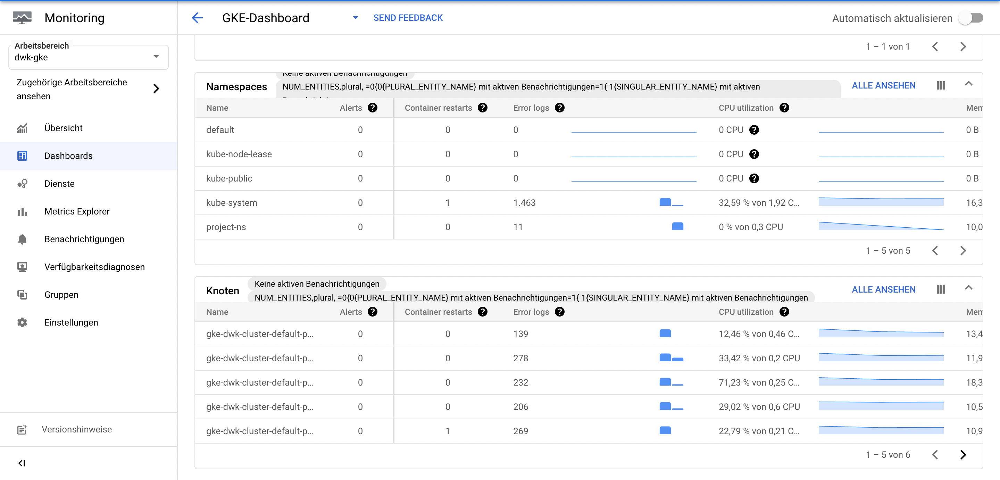
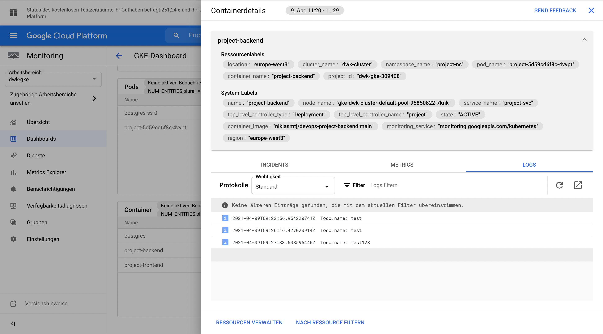

# devopswithkubernetes

- [devopswithkubernetes](#devopswithkubernetes)
  - [Part 1](#part-1)
  - [Part 2](#part-2)
  - [Part 3](#part-3)
  - [Part 4](#part-4)
    - [Exercise 3.01](#exercise-301)
    - [Exercise 3.02](#exercise-302)
    - [Exercise 3.03](#exercise-303)
    - [Exercise 3.04](#exercise-304)
    - [Exercise 3.05](#exercise-305)
    - [Exercise 3.06](#exercise-306)
      - [DBaaS](#dbaas)
      - [DIY Database](#diy-database)
    - [Exercise 3.07](#exercise-307)
    - [Exercise 3.10](#exercise-310)

## Part 1

| Exercise | Directory                  |
| -------- | -------------------------- |
| 1.01     | `main-app`                 |
| 1.02     | `project`                  |
| 1.03     | `main-app`                 |
| 1.04     | `project`                  |
| 1.05     | `project`                  |
| 1.06     | `project`                  |
| 1.07     | `main-app`                 |
| 1.08     | `project`                  |
| 1.09     | `main-app` and `ping-pong` |
| 1.10     | `main-app` and `ping-pong` |
| 1.11     | `main-app` and `ping-pong` |
| 1.12     | `project`                  |
| 1.13     | `project`                  |

The images defined in the deployments use the `:latest` tag. This is not a good practice in production but is here used for quicker deployment of changed containers. In production it is recommended to use fixed container labels or `sha` checksums to reduce possible problems with newer containers.

The `project` is labeled as seen in the exercises. The releases can be found [here](https://github.com/niklasmtj/devopswithkubernetes/releases).

## Part 2

| Exercise | Directory                  |
| -------- | -------------------------- |
| 2.01     | `main-app` and `ping-pong` |
| 2.02     | `project`                  |
| 2.03     | `main-app` and `ping-pong` |
| 2.04     | `project`                  |
| 2.06     | `main-app` and `ping-pong` |
| 2.07     | `main-app` and `ping-pong` |
| 2.08     | `project`                  |
| 2.09     | `project`                  |
| 2.10     | `project`                  |


## Part 3
| Exercise | Directory                  |
| -------- | -------------------------- |
| 3.01     | `ping-pong`                |
| 3.02     | `main-app` and `ping-pong` |
| 3.03     | `project`                  |
| 3.04     | `project`                  |
| 3.05     | `project`                  |
| 3.06     | `project`                  |
| 3.07     | `project`                  |
| 3.08     | `project`                  |
| 3.09     | `main-app` and `ping-pong` |
| 3.10     | `project`                  |

## Part 4
| Exercise | Directory                  |
| -------- | -------------------------- |
| 4.01     | `main-app` and `ping-pong` |

### Exercise 3.01

Since the containers were built for `arm64` I had to rebuild them to work on GCP. I did this with `docker build --platform linux/amd64 -t  niklasmtj/ping-pong .` which will build an `amd64` container image.

```zsh
➜  ping-pong git:(main) ✗ k apply -f gke-manifests
configmap/pingpong-create-db-cm unchanged
deployment.apps/ping-pong created
persistentvolumeclaim/image-claim unchanged
sealedsecret.bitnami.com/pingpong-db-secret unchanged
service/ping-pong-svc unchanged
service/postgres-svc unchanged
statefulset.apps/postgres-ss configured
```

```zsh
➜  ping-pong git:(main) ✗ k get pods --watch
NAME                        READY   STATUS              RESTARTS   AGE
ping-pong-b584578db-bqktv   0/1     ContainerCreating   0          11s
postgres-ss-0               1/1     Running             0          23m
ping-pong-b584578db-bqktv   1/1     Running             0          30s
```

```zsh
➜  ping-pong git:(main) ✗ k get svc
NAME            TYPE           CLUSTER-IP     EXTERNAL-IP    PORT(S)        AGE
ping-pong-svc   LoadBalancer   10.3.249.245   34.107.71.26   80:30431/TCP   23m
postgres-svc    ClusterIP      None           <none>         5432/TCP       23m
```


### Exercise 3.02

I had to rebuild my containers for `linux/amd64` with: `docker build --platform linux/amd64 -t niklasmtj/main-app-server -f Dockerfile.server .` and `docker build --platform linux/amd64 -t niklasmtj/main-app-generator -f Dockerfile.generator .`
```zsh
➜  main-app git:(main) ✗ k apply -f gke-manifests
configmap/main-app-config-map created
deployment.apps/random-string created
ingress.extensions/random-string-ingress created
persistentvolumeclaim/image-claim unchanged
persistentvolume/main-app-pv created
service/random-string-svc created
```

When the Deployment stays at `pending` this could mean that there are not enough resources to use for Kubernetes to start the Pods.

```zsh
➜  main-app git:(main) ✗ k get po --watch
NAME                             READY   STATUS    RESTARTS   AGE
ping-pong-b584578db-bqktv        1/1     Running   0          18m
postgres-ss-0                    1/1     Running   0          41m
random-string-58d999f8d5-k8pmz   0/2     Pending   0          10s
```

Because my Kubernetes VSCode extension always bugged me to use resource limits I added them before. This seemed to be the problem here. After removing them the Pods were able to be created.

```zsh
➜  ping-pong git:(main) ✗ k describe ingress random-string-ingress
Name:             random-string-ingress
Namespace:        main-app
Address:          35.190.51.0
Default backend:  default-http-backend:80 (10.0.2.3:8080)
Rules:
  Host        Path  Backends
  ----        ----  --------
  *
              /           random-string-svc:80 (10.0.2.8:3000)
              /pingpong   ping-pong-svc:80 (10.0.3.10:3000)
```

### Exercise 3.03
I added a workflow to build and deploy the project on every new push to the project directory. The workflow can be found here: [actions-release-server-to-gcp.yaml](https://github.com/niklasmtj/devopswithkubernetes/blob/main/.github/workflows/actions-release-server-to-gcp.yaml)

### Exercise 3.04
This workflow can be found here: [actions-release-branch-to-gcp.yaml](https://github.com/niklasmtj/devopswithkubernetes/blob/main/.github/workflows/actions-release-branch-to-gcp.yaml)

### Exercise 3.05

The workflow can be found here: [project-delete-branch.yaml](https://github.com/niklasmtj/devopswithkubernetes/blob/main/.github/workflows/project-delete-branch.yaml)

### Exercise 3.06

#### DBaaS
**Pro**
* No maintanance for DB version upgrades
* Click to install
* Support around the clock
* Quick scaling 
* Automated backups, replication, encryption patches and capacity increase
* No provisioning


**Contra**
* Vendor Lockin
* Costly and not included
	* $36.18 per vCPU/month
	* $6.18 per GB of Memory/month
	* Shared-core instances for $9.20/month (0.6 GB RAM)
* Costs when service traffic peaks is not predictable
* Have to wait for the provider to do version upgrades

#### DIY Database

**Pro**
* Free to choose version of database
* Cheaper in monthly costs
* Most of the work is already done because of the course
* Quicker to address possible problems with database
* Easier migration to different cloud provider or on-premise solution

**Contra**
* Manual implementation of backup method
* More work to setup and maintain but already done

### Exercise 3.07
I choose the Postgres with PersistentVolumeClaims since this method is already done and I am more flexible about moving my application to another provider. Another reason is that the billing of this method is a lot more predictable.

### Exercise 3.10

